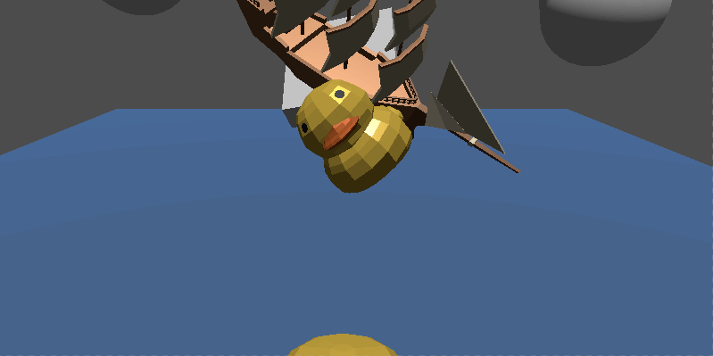
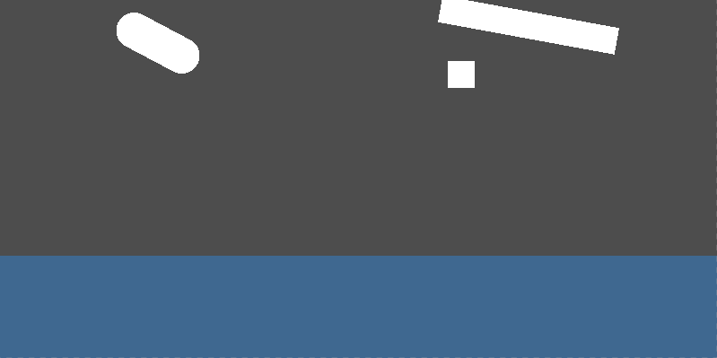
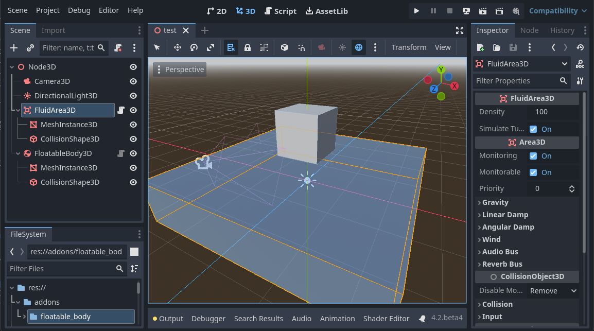

[English](README.md)

# FloatableBody

## はじめに

これはGodot Engine 4で動作するシンプルな物理システムで、オブジェクトが水のような流体に浮く挙動をシミュレートします。

- 浮力の制御コードは全てGDScriptで書かれています
- 物理計算は簡略化しているため、モバイルやWebでも十分機能します
- 3Dと2Dどちらでも使用可能です

## 使い方
水中を表現する`FluidArea3D`ノードと、浮遊するオブジェクトを表現する`FloatableBody3D`ノードを使ってシーンを作ります。

1. まず`FluidArea3D`ノードをシーンに追加します。これは`Area3D`を継承したノードなので、これに`CollisionShape3D`を子ノードとして追加し形状を設定します。視覚的に説得力を持たせるため`MeshInstance3D`を追加するのがオススメです。
2. 次に`FloatableBody3D`ノードをシーンに追加します。これは`RigidBody3D`を継承したノードなので、これに`CollisionShape3D`を子ノードとして追加し形状を設定します。
3. シーンをPlayします。`FloatableBody3D`が落下して`FluidArea3D`に入ると浮力によって浮上します。

上記は3Dの説明ですが、2Dの場合も手順は同じです。3Dを2Dに置き換えてください。

## パラメータ仕様
`FloatableBody3D/2D`が水中で浮上するために重要なパラメータについて説明します。
- `FluidArea3D/2D`の流体密度 (`Density`)
  - 流体密度はを増やすほど浮力が大きくなります。
- `RigidBody3D/2D`の質量 (`Mass`)
  - オブジェクトの質量は増やすほど浮力は小さくなります。
- `RigidBody3D/2D`の重心 (`Center of Mass`)
  - オブジェクトの重心は安定感に影響します。船などは重心を下げると自然な動きになるでしょう。
- `CollisionShape3D/2D`の`Shape3D/2D`の体積 (`Size`, `Radius`, `Height`)
  - オブジェクトの体積は増やすほど浮力も大きくなります。大きいオブジェクトは質量を増やしてバランスを取りましょう。
- `FloatableBody3D/2D`の流体抵抗 (`Fluid Damp`)
  - 抵抗は増やすと流体内で動きにくくなります。これが小さいと不自然な動きになるため抵抗を増やして安定させましょう。

## 応用的な使い方
`CharacterBody3D/2D`で浮力を使用したいケースは、`FluidInteractor3D/2D`を使用します。これは`FloatableBody3D/2D`の内部で使用しているクラスです。

サンプルコードとして`FloatablePlayer3D/2D`があります。詳しい使用方法はそちらを参照してください。

- [floatable_player_3d.gd](addons/floatable_body/floatable_player_3d.gd)
- [floatable_player_2d.gd](addons/floatable_body/floatable_player_2d.gd)

## Using Assets (Demo)
- Sail Ship by Quaternius (https://poly.pizza/m/cIzO4MBPqI)
- Rubber Duck by CreativeTrio (https://poly.pizza/m/oH3dEdlDpB)
- Crate by Quaternius (https://poly.pizza/m/SfJtdV8GDr)
- Coin by Quaternius (https://poly.pizza/m/7IrL01B97W)
- "Water drop (splash)" by bolkmar is marked with CC0 1.0.
- "POOL SPLASH 3" by tbsounddesigns is marked with CC0 1.0.
- "Plingy Coin" by Fupicat is marked with CC0 1.0.
- "Goose And Duck" by ChunaawChika09 is marked with CC0 1.0.
